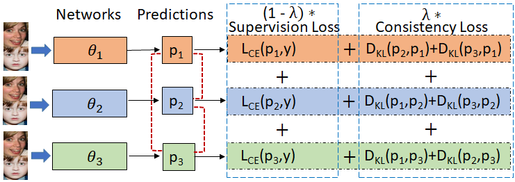

<strong>Title:</strong> ECCT: Ensemble Consensual Collaborative Training for Facial Expression Recognition with Noisy Annotations Resnet models  

<strong> Our proposed ECCT framework<strong>
  

 ECCT involves training ensemble of three networks θ1; θ2 and θ3 jointly using a convex combination of supervision loss and consistency loss. Consensus is built by
aligning the posterior distributions (shown as dotted red curves between p1; p2 and p3 ) using consistency loss. Dynamic weighing factor(λ) that balances both the losses is given by Gaussian like ramp-up function.

Annotated FEC Dataset will be released after the publication.

Authors: Darshan Gera and Dr. S. Balasubramanian, SSSIHL

Any queries please mail to:
Contact: darshangera@sssihl.edu.in

Acknowledgments: We dedicate this work to Bhagawan Sri Sathya Sai Baba, Divine Founder Chancellor of Sri Sathya Sai Institute of Higher Learning, PrasanthiNilyam, A.P., India.
